# Corsair Hackathon: Command Inbox — Production Blueprint v2

> Phase 1 (social posts) is complete. This plan covers Phase 2 onward.
> Execution is split into sequential parts: Setup → Backend → Frontend → AI/MCP → Polish/Deploy.

## Context

You are competing in the Corsair Hackathon (prize: MacBook). Build a Superhuman-style
Gmail + Google Calendar Command Inbox using Next.js 14, PostgreSQL, and Corsair for all
integrations. Judging: Corsair Integration (20 pts), Gmail Workflow (15), Calendar Workflow
(15), Productivity UX (15), AI/MCP (15), Engineering Quality (10), Demo/Docs (10).

Winning strategy: dominate on Corsair integration depth (webhooks + MCP + search API all used),
differentiate on innovation (not just a Gmail clone), and nail the demo video.

---

## Phase 2: System Architecture

### Mermaid Flowchart

```mermaid
flowchart TD
    subgraph CLIENT["Frontend — Next.js (Browser)"]
        UI["Command Inbox\n(Split-pane + Priority Badges)"]
        CP["Command Palette ⌘K\n(cmdk)"]
        HK["Hotkey Engine\n(react-hotkeys-hook)"]
        CHAT["AI Agent Sidebar\n(MCP streaming)"]
        CAL["Calendar Overlay\n(week grid + conflicts)"]
        BRIEF["Pre-Meeting Brief\n(AI-generated)"]
        SSE["SSE Client\n(auto-reconnect)"]
    end

    subgraph BACKEND["Backend — Next.js API Routes"]
        AUTH["/api/auth — NextAuth"]
        WHIN["/api/webhooks/corsair\n(HMAC verified)"]
        ACTION["/api/actions — Compose/Archive/Send/RSVP"]
        SEARCH["/api/search — tri-mode"]
        AGENT["/api/agent — MCP agentic loop"]
        CLASSIFY["/api/classify — async queue"]
        EMBED["/api/embed — vector generation"]
        SSEOUT["/api/stream — SSE broadcaster"]
        BRIEF_API["/api/brief — pre-meeting AI"]
        DRAFT["/api/drafts — save/restore"]
        ACTIONS_API["/api/action-items — extracted todos"]
    end

    subgraph DB["PostgreSQL (Neon) + pgvector"]
        direction TB
        USERS[(users)]
        INTEGRATIONS[(corsair_integrations)]
        THREADS[(email_threads)]
        EMAILS[(emails)]
        ATTACH[(email_attachments)]
        DRAFTS[(email_drafts)]
        VECTORS[(email_vectors pgvector)]
        CALS[(calendars)]
        EVENTS[(calendar_events)]
        ATTENDEES[(calendar_event_attendees)]
        LLM_CACHE[(llm_classifications)]
        CONTACTS[(contacts)]
        KBS[(keyboard_shortcuts)]
        SLOGS[(search_logs)]
        WLOG[(webhook_events)]
        AGENT_LOG[(agent_conversations)]
        ITEMS[(action_items)]
        SNOOZE[(scheduled_sends)]
    end

    subgraph CORSAIR["Corsair Platform"]
        CAPI["Corsair Core API"]
        CMCP["Corsair MCP Server"]
        CWH["Corsair Webhook Dispatcher"]
        CSEARCH["Corsair Search API"]
        COAUTH["Corsair OAuth Proxy"]
    end

    subgraph EXT["External Services"]
        GMAIL["Gmail API"]
        GCAL["Google Calendar API"]
        HAIKU["Claude Haiku\n(classify, extract)"]
        SONNET["Claude Sonnet 4.6\n(agent, brief, draft)"]
        EMBED_API["Embedding API\n(voyage-3 or ada-002)"]
    end

    UI --> AUTH
    AUTH <--> COAUTH <--> GMAIL & GCAL
    AUTH --> INTEGRATIONS

    GMAIL --> CWH --> WHIN
    GCAL --> CWH --> WHIN
    WHIN --> EMAILS & EVENTS & THREADS
    WHIN --> CLASSIFY --> HAIKU --> LLM_CACHE
    WHIN --> EMBED --> EMBED_API --> VECTORS
    WHIN --> ACTIONS_API --> HAIKU --> ITEMS
    WHIN --> SSEOUT --> SSE --> UI

    HK --> CP & ACTION & CHAT & CAL & BRIEF
    ACTION --> CAPI --> GMAIL & GCAL
    SEARCH --> VECTORS & SLOGS
    SEARCH --> CSEARCH --> GMAIL
    CHAT --> AGENT --> CMCP --> GMAIL & GCAL
    AGENT --> SONNET
    BRIEF_API --> SONNET
    DRAFT --> DRAFTS
```



### End-to-End Data Flows

**Flow A — Incoming Email (Real-time)**
```
Gmail push → Corsair Webhook Dispatcher
  → HMAC-verified POST /api/webhooks/corsair
  → Upsert: email_threads + emails + email_attachments
  → Async queue: classify (Haiku) + embed (voyage) + extract action items (Haiku)
  → SSE broadcast to user: UI updates without refresh
  → Priority badge appears on thread instantly
```

**Flow B — MCP Agent Multi-step**
```
User: "Schedule meeting with dev@corsair.dev Thu 9am, email him confirmation"
  → /api/agent starts agentic loop with Claude Sonnet 4.6
  → Tool call 1: list_calendar_events(Thu) → check for conflicts
  → Tool call 2: create_calendar_event(Thu 9am, attendees=[dev@corsair.dev])
  → Tool call 3: send_email(to=dev@corsair.dev, subject=Confirmation, body=...)
  → Each tool call goes through Corsair MCP → real Gmail/GCal mutation
  → Streamed back to UI as action cards in agent sidebar
```

**Flow C — Pre-Meeting Brief**
```
Calendar SSE event: event starting in 30 minutes
  → /api/brief: fetch attendees' email history (pgvector similarity)
  → Claude Sonnet: "Summarize context, open items, and suggest a conversation starter"
  → Brief pushed to UI as notification card with expand option
```

**Flow D — Search (Tri-mode)**
```
User types query:
  → Parallel:
    a) pgvector ANN: embedding similarity on local emails (< 100ms)
    b) FTS GIN: keyword match on subject + snippet (< 50ms)
    c) Corsair Search API: live Gmail query for freshest results
  → Results merged, deduplicated by gmail_message_id, ranked by combined score
  → Keyboard-navigable overlay with thread preview
```

---

## Phase 3: Database Schema (Merged + Upgraded)

### Complete SQL (Production-Ready)

```sql
-- Enable extensions
CREATE EXTENSION IF NOT EXISTS vector;
CREATE EXTENSION IF NOT EXISTS "uuid-ossp";
CREATE EXTENSION IF NOT EXISTS pg_trgm; -- for fuzzy search

-- Auto-update timestamp trigger
CREATE OR REPLACE FUNCTION set_updated_at()
RETURNS TRIGGER AS $$
BEGIN NEW.updated_at = NOW(); RETURN NEW; END;
$$ LANGUAGE plpgsql;

-- ─────────────────────────────────────────────
-- USERS
-- ─────────────────────────────────────────────
CREATE TABLE users (
    id            UUID PRIMARY KEY DEFAULT gen_random_uuid(),
    email         VARCHAR(255) UNIQUE NOT NULL,
    google_id     VARCHAR(255) UNIQUE,
    name          VARCHAR(255),
    avatar_url    TEXT,
    preferences   JSONB DEFAULT '{
        "theme": "dark",
        "density": "comfortable",
        "snooze_default_minutes": 60,
        "send_undo_seconds": 10,
        "brief_minutes_before": 5
    }'::jsonb,
    created_at    TIMESTAMPTZ DEFAULT NOW(),
    updated_at    TIMESTAMPTZ DEFAULT NOW()
);
CREATE TRIGGER users_upd BEFORE UPDATE ON users
    FOR EACH ROW EXECUTE FUNCTION set_updated_at();
CREATE INDEX idx_users_email ON users(email);
CREATE INDEX idx_users_google_id ON users(google_id);

-- ─────────────────────────────────────────────
-- CORSAIR INTEGRATIONS (one row per provider per user)
-- ─────────────────────────────────────────────
CREATE TABLE corsair_integrations (
    id                    UUID PRIMARY KEY DEFAULT gen_random_uuid(),
    user_id               UUID NOT NULL REFERENCES users(id) ON DELETE CASCADE,
    provider              VARCHAR(20) NOT NULL, -- 'gmail' | 'gcal'
    corsair_connection_id VARCHAR(255) UNIQUE NOT NULL,
    access_token_enc      TEXT NOT NULL,        -- AES-256-GCM encrypted
    refresh_token_enc     TEXT NOT NULL,
    token_expires_at      TIMESTAMPTZ,
    connected_email       VARCHAR(255),         -- which Google account
    metadata              JSONB DEFAULT '{}',   -- scopes, account display name
    created_at            TIMESTAMPTZ DEFAULT NOW(),
    updated_at            TIMESTAMPTZ DEFAULT NOW(),
    UNIQUE(user_id, provider)
);
CREATE TRIGGER integrations_upd BEFORE UPDATE ON corsair_integrations
    FOR EACH ROW EXECUTE FUNCTION set_updated_at();
CREATE INDEX idx_integrations_user ON corsair_integrations(user_id);

-- ─────────────────────────────────────────────
-- EMAIL_THREADS (one row per thread)
-- ─────────────────────────────────────────────
CREATE TABLE email_threads (
    id                UUID PRIMARY KEY DEFAULT gen_random_uuid(),
    user_id           UUID NOT NULL REFERENCES users(id) ON DELETE CASCADE,
    gmail_thread_id   VARCHAR(255) NOT NULL,
    subject           TEXT,
    snippet           VARCHAR(300),
    participant_emails TEXT[],
    message_count     INTEGER DEFAULT 1,
    is_read           BOOLEAN DEFAULT false,
    is_starred        BOOLEAN DEFAULT false,
    is_archived       BOOLEAN DEFAULT false,
    is_trashed        BOOLEAN DEFAULT false,
    is_snoozed        BOOLEAN DEFAULT false,
    snoozed_until     TIMESTAMPTZ,
    gmail_labels      TEXT[] DEFAULT '{}',
    last_message_at   TIMESTAMPTZ,
    created_at        TIMESTAMPTZ DEFAULT NOW(),
    updated_at        TIMESTAMPTZ DEFAULT NOW(),
    UNIQUE(user_id, gmail_thread_id)
);
CREATE TRIGGER threads_upd BEFORE UPDATE ON email_threads
    FOR EACH ROW EXECUTE FUNCTION set_updated_at();
-- Priority inbox: unarchived threads by recency
CREATE INDEX idx_threads_inbox ON email_threads(user_id, last_message_at DESC)
    WHERE is_archived = false AND is_trashed = false AND is_snoozed = false;
-- Snoozed email revival
CREATE INDEX idx_threads_snoozed ON email_threads(snoozed_until)
    WHERE is_snoozed = true;

-- ─────────────────────────────────────────────
-- EMAILS (one row per message)
-- ─────────────────────────────────────────────
CREATE TABLE emails (
    id               UUID PRIMARY KEY DEFAULT gen_random_uuid(),
    thread_id        UUID NOT NULL REFERENCES email_threads(id) ON DELETE CASCADE,
    user_id          UUID NOT NULL REFERENCES users(id) ON DELETE CASCADE,
    gmail_message_id VARCHAR(255) UNIQUE NOT NULL,
    from_email       VARCHAR(255),
    from_name        VARCHAR(255),
    to_emails        TEXT[] DEFAULT '{}',
    cc_emails        TEXT[] DEFAULT '{}',
    bcc_emails       TEXT[] DEFAULT '{}',
    reply_to         VARCHAR(255),
    subject          TEXT,
    body_text        TEXT,
    body_snippet     VARCHAR(500),
    body_html        TEXT,
    gmail_labels     TEXT[] DEFAULT '{}',
    is_sent          BOOLEAN DEFAULT false,  -- from Sent folder
    sent_at          TIMESTAMPTZ,
    received_at      TIMESTAMPTZ,
    created_at       TIMESTAMPTZ DEFAULT NOW()
);
CREATE INDEX idx_emails_thread ON emails(thread_id);
CREATE INDEX idx_emails_user_received ON emails(user_id, received_at DESC);
-- Full-text search (keyword mode)
CREATE INDEX idx_emails_fts ON emails USING GIN(
    to_tsvector('english', coalesce(subject,'') || ' ' || coalesce(body_snippet,''))
);

-- ─────────────────────────────────────────────
-- EMAIL_ATTACHMENTS
-- ─────────────────────────────────────────────
CREATE TABLE email_attachments (
    id         UUID PRIMARY KEY DEFAULT gen_random_uuid(),
    email_id   UUID NOT NULL REFERENCES emails(id) ON DELETE CASCADE,
    filename   VARCHAR(500),
    mime_type  VARCHAR(100),
    size_bytes INTEGER,
    url        TEXT,           -- Corsair-proxied download URL
    created_at TIMESTAMPTZ DEFAULT NOW()
);
CREATE INDEX idx_attachments_email ON email_attachments(email_id);

-- ─────────────────────────────────────────────
-- LLM_CLASSIFICATIONS (separate — allows reclassification without touching emails)
-- ─────────────────────────────────────────────
CREATE TABLE llm_classifications (
    id               UUID PRIMARY KEY DEFAULT gen_random_uuid(),
    email_id         UUID NOT NULL REFERENCES emails(id) ON DELETE CASCADE UNIQUE,
    priority         VARCHAR(10) NOT NULL DEFAULT 'normal', -- urgent|high|normal|low
    priority_score   FLOAT,          -- 0-1 for sorting within same tier
    tags             TEXT[] DEFAULT '{}', -- action-required, finance, travel, meeting, etc.
    summary          TEXT,           -- one-line AI summary
    confidence       FLOAT,
    model_used       VARCHAR(50),    -- claude-haiku-4-5-20251001
    prompt_tokens    INTEGER,
    classified_at    TIMESTAMPTZ DEFAULT NOW()
);
CREATE INDEX idx_classifications_priority ON llm_classifications(priority, priority_score DESC);
CREATE INDEX idx_classifications_email ON llm_classifications(email_id);

-- ─────────────────────────────────────────────
-- ACTION_ITEMS (extracted to-dos from emails — innovative)
-- ─────────────────────────────────────────────
CREATE TABLE action_items (
    id          UUID PRIMARY KEY DEFAULT gen_random_uuid(),
    user_id     UUID NOT NULL REFERENCES users(id) ON DELETE CASCADE,
    email_id    UUID REFERENCES emails(id) ON DELETE SET NULL,
    thread_id   UUID REFERENCES email_threads(id) ON DELETE SET NULL,
    description TEXT NOT NULL,      -- "Reply to Sarah by Friday"
    due_date    TIMESTAMPTZ,        -- extracted from email if found
    is_done     BOOLEAN DEFAULT false,
    created_at  TIMESTAMPTZ DEFAULT NOW(),
    updated_at  TIMESTAMPTZ DEFAULT NOW()
);
CREATE TRIGGER items_upd BEFORE UPDATE ON action_items
    FOR EACH ROW EXECUTE FUNCTION set_updated_at();
CREATE INDEX idx_items_user ON action_items(user_id, is_done, created_at DESC);

-- ─────────────────────────────────────────────
-- EMAIL_VECTORS (separate table — keeps emails lean, allows multi-chunk)
-- ─────────────────────────────────────────────
CREATE TABLE email_vectors (
    id         UUID PRIMARY KEY DEFAULT gen_random_uuid(),
    email_id   UUID NOT NULL REFERENCES emails(id) ON DELETE CASCADE,
    chunk_text TEXT,                       -- text used for this chunk
    embedding  vector(1024),               -- voyage-3 dim=1024
    created_at TIMESTAMPTZ DEFAULT NOW()
);
-- IVFFlat index: fast ANN at 10k+ emails, lists=100 covers up to 1M rows
CREATE INDEX idx_vectors_ann ON email_vectors
    USING ivfflat (embedding vector_cosine_ops) WITH (lists = 100);
CREATE INDEX idx_vectors_email ON email_vectors(email_id);

-- ─────────────────────────────────────────────
-- EMAIL_DRAFTS (persistent drafts with AI suggestions)
-- ─────────────────────────────────────────────
CREATE TABLE email_drafts (
    id             UUID PRIMARY KEY DEFAULT gen_random_uuid(),
    user_id        UUID NOT NULL REFERENCES users(id) ON DELETE CASCADE,
    thread_id      VARCHAR(255),          -- nullable: null = new thread
    to_emails      TEXT[] DEFAULT '{}',
    cc_emails      TEXT[] DEFAULT '{}',
    bcc_emails     TEXT[] DEFAULT '{}',
    subject        TEXT,
    body           TEXT,
    ai_suggestions JSONB DEFAULT '{
        "subject_alternatives": [],
        "tone": "professional",
        "length_feedback": "",
        "completions": []
    }'::jsonb,
    is_scheduled   BOOLEAN DEFAULT false,
    scheduled_at   TIMESTAMPTZ,           -- Send Later feature
    created_at     TIMESTAMPTZ DEFAULT NOW(),
    updated_at     TIMESTAMPTZ DEFAULT NOW()
);
CREATE TRIGGER drafts_upd BEFORE UPDATE ON email_drafts
    FOR EACH ROW EXECUTE FUNCTION set_updated_at();
CREATE INDEX idx_drafts_user ON email_drafts(user_id, updated_at DESC);

-- ─────────────────────────────────────────────
-- CONTACTS (interaction intelligence — innovative)
-- ─────────────────────────────────────────────
CREATE TABLE contacts (
    id                 UUID PRIMARY KEY DEFAULT gen_random_uuid(),
    user_id            UUID NOT NULL REFERENCES users(id) ON DELETE CASCADE,
    email              VARCHAR(255) NOT NULL,
    name               VARCHAR(255),
    email_count        INTEGER DEFAULT 0,   -- total emails exchanged
    last_emailed_at    TIMESTAMPTZ,
    avg_reply_hours    FLOAT,               -- your avg response time to them
    first_seen_at      TIMESTAMPTZ DEFAULT NOW(),
    UNIQUE(user_id, email)
);
CREATE INDEX idx_contacts_user ON contacts(user_id);
CREATE INDEX idx_contacts_email ON contacts(user_id, email);

-- ─────────────────────────────────────────────
-- CALENDARS (normalized: one row per Google Calendar)
-- ─────────────────────────────────────────────
CREATE TABLE calendars (
    id          UUID PRIMARY KEY DEFAULT gen_random_uuid(),
    user_id     UUID NOT NULL REFERENCES users(id) ON DELETE CASCADE,
    google_cal_id VARCHAR(255) UNIQUE NOT NULL,
    name        VARCHAR(255),
    description TEXT,
    color_hex   VARCHAR(7),
    timezone    VARCHAR(100),
    is_primary  BOOLEAN DEFAULT false,
    is_readonly BOOLEAN DEFAULT false,
    updated_at  TIMESTAMPTZ DEFAULT NOW()
);
CREATE INDEX idx_calendars_user ON calendars(user_id);

-- ─────────────────────────────────────────────
-- CALENDAR_EVENTS
-- ─────────────────────────────────────────────
CREATE TABLE calendar_events (
    id                      UUID PRIMARY KEY DEFAULT gen_random_uuid(),
    calendar_id             UUID NOT NULL REFERENCES calendars(id) ON DELETE CASCADE,
    user_id                 UUID NOT NULL REFERENCES users(id) ON DELETE CASCADE,
    google_event_id         VARCHAR(255) UNIQUE NOT NULL,
    title                   VARCHAR(500),
    description             TEXT,
    location                VARCHAR(500),
    start_time              TIMESTAMPTZ,
    end_time                TIMESTAMPTZ,
    is_all_day              BOOLEAN DEFAULT false,
    status                  VARCHAR(20) DEFAULT 'confirmed', -- confirmed|tentative|cancelled
    visibility              VARCHAR(20) DEFAULT 'public',
    organizer_email         VARCHAR(255),
    meeting_link            TEXT,              -- Google Meet URL
    conference_data         JSONB DEFAULT '{}', -- Zoom, Teams, etc.
    recurrence_rules        TEXT[] DEFAULT '{}',
    related_email_thread_id UUID REFERENCES email_threads(id) ON DELETE SET NULL,
    ai_brief                TEXT,              -- pre-meeting AI brief
    brief_generated_at      TIMESTAMPTZ,
    created_at              TIMESTAMPTZ DEFAULT NOW(),
    updated_at              TIMESTAMPTZ DEFAULT NOW()
);
CREATE TRIGGER events_upd BEFORE UPDATE ON calendar_events
    FOR EACH ROW EXECUTE FUNCTION set_updated_at();
-- Upcoming events query
CREATE INDEX idx_events_upcoming ON calendar_events(user_id, start_time ASC)
    WHERE status != 'cancelled';
-- Conflict detection: range index
CREATE INDEX idx_events_range ON calendar_events(calendar_id, start_time, end_time)
    WHERE status != 'cancelled';
-- Pre-meeting brief trigger: events in next 30 minutes
CREATE INDEX idx_events_brief ON calendar_events(start_time)
    WHERE ai_brief IS NULL AND status = 'confirmed';

-- ─────────────────────────────────────────────
-- CALENDAR_EVENT_ATTENDEES (normalized attendees)
-- ─────────────────────────────────────────────
CREATE TABLE calendar_event_attendees (
    id           UUID PRIMARY KEY DEFAULT gen_random_uuid(),
    event_id     UUID NOT NULL REFERENCES calendar_events(id) ON DELETE CASCADE,
    email        VARCHAR(255) NOT NULL,
    name         VARCHAR(255),
    rsvp_status  VARCHAR(20) DEFAULT 'needsAction', -- accepted|declined|tentative|needsAction
    is_organizer BOOLEAN DEFAULT false,
    updated_at   TIMESTAMPTZ DEFAULT NOW()
);
CREATE INDEX idx_attendees_event ON calendar_event_attendees(event_id);
CREATE INDEX idx_attendees_email ON calendar_event_attendees(email);

-- ─────────────────────────────────────────────
-- KEYBOARD_SHORTCUTS (per-user customization)
-- ─────────────────────────────────────────────
CREATE TABLE keyboard_shortcuts (
    id           UUID PRIMARY KEY DEFAULT gen_random_uuid(),
    user_id      UUID NOT NULL REFERENCES users(id) ON DELETE CASCADE,
    action       VARCHAR(100) NOT NULL,  -- 'archive', 'reply', 'compose', etc.
    shortcut_key VARCHAR(50) NOT NULL,   -- 'e', 'cmd+k', 'g i'
    is_active    BOOLEAN DEFAULT true,
    created_at   TIMESTAMPTZ DEFAULT NOW(),
    UNIQUE(user_id, action)
);
CREATE INDEX idx_shortcuts_user ON keyboard_shortcuts(user_id);

-- ─────────────────────────────────────────────
-- SEARCH_LOGS (with query embeddings for repeat-search caching)
-- ─────────────────────────────────────────────
CREATE TABLE search_logs (
    id                UUID PRIMARY KEY DEFAULT gen_random_uuid(),
    user_id           UUID NOT NULL REFERENCES users(id) ON DELETE CASCADE,
    query             TEXT NOT NULL,
    query_embedding   vector(1024),
    result_count      INTEGER,
    execution_time_ms INTEGER,
    created_at        TIMESTAMPTZ DEFAULT NOW()
);
CREATE INDEX idx_slogs_user ON search_logs(user_id, created_at DESC);

-- ─────────────────────────────────────────────
-- WEBHOOK_EVENTS (with deduplication)
-- ─────────────────────────────────────────────
CREATE TABLE webhook_events (
    id           UUID PRIMARY KEY DEFAULT gen_random_uuid(),
    user_id      UUID NOT NULL REFERENCES users(id) ON DELETE CASCADE,
    source       VARCHAR(10) NOT NULL,   -- 'gmail' | 'gcal'
    event_type   VARCHAR(50) NOT NULL,
    resource_id  VARCHAR(255),
    raw_payload  JSONB,
    processed    BOOLEAN DEFAULT false,
    error_msg    TEXT,
    processed_at TIMESTAMPTZ,
    created_at   TIMESTAMPTZ DEFAULT NOW()
);
CREATE UNIQUE INDEX idx_webhook_dedup ON webhook_events(source, resource_id)
    WHERE processed = true;
CREATE INDEX idx_webhook_unprocessed ON webhook_events(processed, created_at)
    WHERE processed = false;

-- ─────────────────────────────────────────────
-- AGENT_CONVERSATIONS (MCP memory persistence)
-- ─────────────────────────────────────────────
CREATE TABLE agent_conversations (
    id             UUID PRIMARY KEY DEFAULT gen_random_uuid(),
    user_id        UUID NOT NULL REFERENCES users(id) ON DELETE CASCADE,
    messages       JSONB NOT NULL DEFAULT '[]', -- [{role, content, tool_calls, tool_results}]
    actions_taken  TEXT[] DEFAULT '{}',         -- ['email_sent', 'event_created']
    created_at     TIMESTAMPTZ DEFAULT NOW(),
    updated_at     TIMESTAMPTZ DEFAULT NOW()
);
CREATE TRIGGER agent_upd BEFORE UPDATE ON agent_conversations
    FOR EACH ROW EXECUTE FUNCTION set_updated_at();
```

### Key Query Patterns

```sql
-- Priority inbox (unread, unarchived, ordered by tier then score)
SELECT t.*, lc.priority, lc.priority_score, lc.summary
FROM email_threads t
JOIN emails e ON e.thread_id = t.id
LEFT JOIN llm_classifications lc ON lc.email_id = e.id
WHERE t.user_id = $1
  AND t.is_archived = false
  AND t.is_trashed = false
  AND t.is_snoozed = false
ORDER BY
  CASE lc.priority WHEN 'urgent' THEN 0 WHEN 'high' THEN 1
                   WHEN 'normal' THEN 2 ELSE 3 END,
  lc.priority_score DESC,
  t.last_message_at DESC
LIMIT 50;

-- Semantic email search (pgvector ANN)
SELECT e.*, 1 - (ev.embedding <=> $embedding::vector) AS similarity
FROM email_vectors ev
JOIN emails e ON e.id = ev.email_id
WHERE e.user_id = $1
  AND 1 - (ev.embedding <=> $embedding::vector) > 0.72
ORDER BY similarity DESC
LIMIT 20;

-- Full-text keyword search
SELECT e.*, ts_rank(to_tsvector('english', coalesce(subject,'') || ' ' || coalesce(body_snippet,'')),
                    plainto_tsquery('english', $2)) AS rank
FROM emails e
WHERE e.user_id = $1
  AND to_tsvector('english', coalesce(subject,'') || ' ' || coalesce(body_snippet,''))
      @@ plainto_tsquery('english', $2)
ORDER BY rank DESC LIMIT 20;

-- Calendar conflict detection
SELECT e2.title, e2.start_time, e2.end_time
FROM calendar_events e1
JOIN calendar_events e2 ON e1.calendar_id = e2.calendar_id AND e1.id != e2.id
WHERE e1.google_event_id = $new_event_id
  AND e2.start_time < e1.end_time
  AND e2.end_time > e1.start_time
  AND e2.status != 'cancelled';

-- Pre-meeting brief: emails with attendees in last 30 days
SELECT e.subject, e.from_email, e.body_snippet, e.received_at
FROM emails e
WHERE e.user_id = $1
  AND (e.from_email = ANY($attendee_emails) OR e.to_emails && $attendee_emails)
  AND e.received_at > NOW() - INTERVAL '30 days'
ORDER BY e.received_at DESC LIMIT 10;

-- Snoozed emails to wake up
SELECT * FROM email_threads
WHERE is_snoozed = true AND snoozed_until <= NOW();
```

---

## Phase 4: Frontend Architecture

### Project Structure

```
src/
  app/
    (auth)/login/page.tsx
    (inbox)/
      layout.tsx          ← HotkeyProvider + SSEProvider + global stores init
      page.tsx            ← Inbox: split pane + priority tabs
      compose/page.tsx    ← Full-page compose (fallback)
    api/
      auth/[...nextauth]/route.ts
      webhooks/corsair/route.ts
      actions/[action]/route.ts    ← archive, star, trash, send, rsvp
      search/route.ts
      agent/route.ts               ← streaming response
      stream/route.ts              ← SSE per-user broadcaster
      brief/[eventId]/route.ts     ← pre-meeting brief generation
      drafts/route.ts
      embed/route.ts               ← generate + store embeddings
      action-items/route.ts
  components/
    inbox/
      ThreadList.tsx               ← virtualized (react-virtual)
      ThreadItem.tsx               ← priority badge + AI summary + snippet
      EmailView.tsx                ← sanitized HTML render + action bar
      PriorityTabs.tsx             ← All | Urgent | High | Action Required
    compose/
      ComposeModal.tsx             ← slide-up sheet
      AIWritingAssistant.tsx       ← real-time Claude suggestions
    calendar/
      CalendarSidebar.tsx          ← today's events + conflicts
      WeekGrid.tsx                 ← draggable week view
      EventCard.tsx                ← meeting link, attendees, conflict badge
      PreMeetingBrief.tsx          ← AI brief card
    agent/
      AgentSidebar.tsx             ← sliding panel
      AgentMessage.tsx             ← streamed text
      ToolCard.tsx                 ← animated "Sending email..." action card
    actions/
      ActionBoard.tsx              ← extracted to-do list from emails
    search/
      SearchOverlay.tsx            ← tri-mode: vector + FTS + live
      SearchResult.tsx
    shared/
      CommandPalette.tsx           ← cmdk
      PriorityBadge.tsx
      KeyboardShortcutModal.tsx    ← ? key overlay
      UndoToast.tsx                ← 10-second undo send
  hooks/
    useSSE.ts           ← EventSource + exponential backoff + queryClient invalidation
    useHotkeys.ts       ← wraps react-hotkeys-hook, disabled in input/textarea
    useInbox.ts         ← TanStack Query: threads + optimistic mutations
    useAgent.ts         ← streaming fetch for agent responses
    useConflicts.ts     ← detect calendar overlap in local DB before creating event
    useUndoSend.ts      ← 10s countdown, cancel before actual send
  store/
    inbox.store.ts      ← Zustand: selectedThread, focusedIndex, compose state
    agent.store.ts      ← Zustand: conversation history, streaming, tool states
    shortcuts.store.ts  ← loaded from DB, merged with defaults
  lib/
    corsair/
      client.ts         ← typed Corsair REST client
      mcp.ts            ← Corsair MCP tool executor
      webhooks.ts       ← HMAC verify + event dispatch
    db/
      schema.ts         ← Drizzle ORM (matches Phase 3 exactly)
      queries/          ← typed query functions per domain
    llm/
      classify.ts       ← Claude Haiku: priority + tags + summary
      extract.ts        ← Claude Haiku: action item extraction
      brief.ts          ← Claude Sonnet: pre-meeting intelligence
      draft-assist.ts   ← Claude Sonnet: compose suggestions
      agent.ts          ← Claude Sonnet: agentic MCP loop
      embed.ts          ← voyage-3 embedding generation
    crypto.ts           ← AES-256-GCM encrypt/decrypt for tokens
    sse.ts              ← SSE broadcaster: Map<userId, Controller>
```

### State Architecture

```
Zustand (synchronous client state)
├── inbox.store: selectedThread, focusedIndex, composeOpen, sidebarState, activeTab
└── agent.store: messages[], isStreaming, pendingToolCalls[], lastActionTaken

TanStack Query (server state + smart cache)
├── ['threads', userId]          staleTime: 30s, invalidated by SSE 'email.*'
├── ['email', threadId]          staleTime: Infinity (email body immutable)
├── ['events', userId, week]     staleTime: 60s, invalidated by SSE 'gcal.*'
├── ['search', query]            staleTime: 10s
├── ['action-items', userId]     staleTime: 30s
└── ['brief', eventId]           staleTime: Infinity per event

SSE → queryClient.invalidateQueries bridge (in layout.tsx):
  'email.received'   → invalidate threads
  'email.classified' → invalidate threads (priority badge update)
  'gcal.event.*'     → invalidate events
  'brief.ready'      → invalidate brief[eventId]
```

### Complete Hotkey Map

```typescript
// Single source of truth — loaded from DB and merged with defaults
const DEFAULT_SHORTCUTS: Record<string, HotkeyAction> = {
  // Navigation (always active, never disabled)
  'j':        { action: 'focusNext',     scope: 'inbox',   label: 'Next email' },
  'k':        { action: 'focusPrev',     scope: 'inbox',   label: 'Prev email' },
  'enter':    { action: 'openThread',    scope: 'inbox',   label: 'Open thread' },
  'escape':   { action: 'back',          scope: 'global',  label: 'Close / Back' },

  // Email actions (active when thread is focused)
  'c':        { action: 'compose',       scope: 'inbox',   label: 'Compose new' },
  'e':        { action: 'archive',       scope: 'thread',  label: 'Archive' },
  'r':        { action: 'reply',         scope: 'thread',  label: 'Reply' },
  'shift+r':  { action: 'replyAll',      scope: 'thread',  label: 'Reply all' },
  'f':        { action: 'forward',       scope: 'thread',  label: 'Forward' },
  '#':        { action: 'trash',         scope: 'thread',  label: 'Delete' },
  'u':        { action: 'toggleRead',    scope: 'thread',  label: 'Mark read/unread' },
  's':        { action: 'toggleStar',    scope: 'thread',  label: 'Star' },
  'h':        { action: 'snooze',        scope: 'thread',  label: 'Snooze' },
  'l':        { action: 'label',         scope: 'thread',  label: 'Apply label' },
  't':        { action: 'createEvent',   scope: 'thread',  label: 'Email → Calendar event' },
  'a':        { action: 'summarize',     scope: 'thread',  label: 'AI summarize thread' },

  // Compose actions (active in compose modal)
  'meta+enter':   { action: 'send',         scope: 'compose', label: 'Send' },
  'meta+shift+d': { action: 'saveDraft',    scope: 'compose', label: 'Save draft' },
  'meta+shift+l': { action: 'sendLater',    scope: 'compose', label: 'Send later' },

  // Global power features
  'meta+k':   { action: 'commandPalette', scope: 'global', label: 'Command palette' },
  'meta+f':   { action: 'search',         scope: 'global', label: 'Search' },
  'meta+/':   { action: 'agentChat',      scope: 'global', label: 'AI agent' },
  'z':        { action: 'undo',           scope: 'global', label: 'Undo last action' },

  // Chords (sequential): hit g then i for "go to inbox"
  'g i':      { action: 'gotoInbox',     scope: 'global', label: 'Go to inbox' },
  'g s':      { action: 'gotoStarred',   scope: 'global', label: 'Go to starred' },
  'g d':      { action: 'gotoDrafts',    scope: 'global', label: 'Go to drafts' },
  'g a':      { action: 'gotoArchive',   scope: 'global', label: 'Go to archive' },
  'g t':      { action: 'gotoActions',   scope: 'global', label: 'Go to action board' },

  // Tabs
  '1':        { action: 'tabAll',        scope: 'inbox',  label: 'All mail' },
  '2':        { action: 'tabUrgent',     scope: 'inbox',  label: 'Urgent' },
  '3':        { action: 'tabHigh',       scope: 'inbox',  label: 'High priority' },
  '4':        { action: 'tabAction',     scope: 'inbox',  label: 'Action required' },

  '?':        { action: 'showShortcuts', scope: 'global', label: 'Show shortcuts' },
};
```

### UI Layout

```
┌──────────────────────────────────────────────────────────────────────────────┐
│  Command Inbox     [⌘K] Command Palette    [⌘F] Search    [Ishan ▾]         │
├──────────┬──────────────────────────────────────────┬────────────────────────┤
│          │ [All] [Urgent 🔴] [High 🟡] [Action ⚡]  │                        │
│  ◉ Inbox │ ─────────────────────────────────────── │  From: Sarah Chen      │
│  ☆ Starred│ 🔴 URGENT  Q3 Review — action needed   │  To: you               │
│  ✎ Drafts │   sarah@company.com · AI: "Approve..."│  Re: Q3 Review         │
│  ↗ Sent  │ ─────────────────────────────────────── │                        │
│  ◻ Snoozed│ 🟡 HIGH  Project Alpha kickoff meeting  │  Hey, the Q3 review    │
│          │   pm@project.io · AI: "Needs your..."  │  deck needs your sign- │
│ ──────── │ ─────────────────────────────────────── │  off by EOD Thursday.  │
│ TODAY    │ ⚡ ACTION  Invoice #4421 awaiting sign  │                        │
│ 9:00 AM  │   billing@co · AI: "Sign before Fri"  │  [R] Reply  [E] Archive│
│ Kickoff  │ ─────────────────────────────────────── │  [F] Fwd    [H] Snooze │
│ 2:00 PM  │ ⚪ NORMAL  Weekly digest — 3 articles   │  [T] → Event  [A] AI   │
│ 1:1 John │   news@sub · AI: "Newsletter, low pri" │                        │
│          │                                        │  ─────────────────────  │
│ ──────── │                                        │  ⚡ ACTION ITEMS         │
│ [⌘/]    │                                        │  □ Reply to Sarah       │
│ AI Agent │                                        │  □ Sign invoice #4421  │
└──────────┴──────────────────────────────────────────┴────────────────────────┘

  ⌘K Command Palette → full-width modal with grouped fuzzy-search actions
  ⌘/ Agent Sidebar → slides in from right, persists conversation
  H key → snooze modal with time presets (1h, tonight, tomorrow, next week, custom)
```

---

## Phase 5: Feature Deep-Dives

### 5.1 Corsair Integration Setup

```typescript
// src/lib/corsair/client.ts
const CORSAIR = 'https://api.corsair.dev/v1';
const headers = () => ({ 'x-api-key': process.env.CORSAIR_API_KEY!, 'Content-Type': 'application/json' });

export const corsair = {
  // Initiate OAuth for Gmail or GCal
  async initOAuth(provider: 'gmail' | 'gcal', userId: string) {
    const r = await fetch(`${CORSAIR}/connections/oauth/init`, {
      method: 'POST', headers: headers(),
      body: JSON.stringify({
        provider,
        redirect_uri: `${process.env.NEXT_PUBLIC_URL}/api/auth/corsair/callback`,
        state: `${userId}:${provider}`,
        scopes: provider === 'gmail'
          ? ['gmail.readonly', 'gmail.send', 'gmail.modify', 'gmail.labels']
          : ['calendar', 'calendar.events'],
      }),
    });
    return (await r.json()).auth_url as string;
  },

  // Exchange code → connection_id + tokens
  async exchangeCode(code: string) {
    const r = await fetch(`${CORSAIR}/connections/oauth/exchange`, {
      method: 'POST', headers: headers(), body: JSON.stringify({ code }),
    });
    return await r.json() as { connection_id: string; access_token: string;
                                refresh_token: string; expires_at: string };
  },

  // Send email through Corsair
  async sendEmail(connectionId: string, payload: SendEmailPayload) {
    return fetch(`${CORSAIR}/gmail/send`, {
      method: 'POST', headers: headers(),
      body: JSON.stringify({ connection_id: connectionId, ...payload }),
    });
  },

  // Archive email
  async archiveEmail(connectionId: string, messageId: string) {
    return fetch(`${CORSAIR}/gmail/modify`, {
      method: 'POST', headers: headers(),
      body: JSON.stringify({ connection_id: connectionId, message_id: messageId,
                             remove_labels: ['INBOX'] }),
    });
  },

  // Register webhook
  async registerWebhook() {
    return fetch(`${CORSAIR}/webhooks`, {
      method: 'POST', headers: headers(),
      body: JSON.stringify({
        url: `${process.env.NEXT_PUBLIC_URL}/api/webhooks/corsair`,
        events: ['gmail.message.received', 'gmail.message.updated', 'gmail.message.sent',
                 'gcal.event.created', 'gcal.event.updated', 'gcal.event.deleted'],
      }),
    });
  },

  // Corsair Search API
  async searchEmails(connectionId: string, query: string, maxResults = 20) {
    const r = await fetch(`${CORSAIR}/gmail/search?connection_id=${connectionId}` +
      `&q=${encodeURIComponent(query)}&max_results=${maxResults}`, { headers: headers() });
    return (await r.json()).messages;
  },
};
```

---

### 5.2 Webhook Pipeline (Complete)

```typescript
// src/app/api/webhooks/corsair/route.ts
import { createHmac, timingSafeEqual } from 'crypto';

export async function POST(req: Request) {
  const sig = req.headers.get('x-corsair-signature') ?? '';
  const rawBody = await req.text();

  // HMAC verification (timing-safe)
  const expected = 'sha256=' + createHmac('sha256', process.env.CORSAIR_WEBHOOK_SECRET!)
    .update(rawBody).digest('hex');
  if (!timingSafeEqual(Buffer.from(sig), Buffer.from(expected)))
    return new Response('Unauthorized', { status: 401 });

  const { event_type, user_id, data } = JSON.parse(rawBody);

  // Idempotency: skip if already processed
  const logged = await db.insert(webhookEvents).values({
    userId: user_id, source: event_type.startsWith('gmail') ? 'gmail' : 'gcal',
    eventType: event_type, resourceId: data.message_id ?? data.event_id,
    rawPayload: data,
  }).onConflictDoNothing().returning();
  if (logged.length === 0) return new Response('Duplicate', { status: 200 });

  // Dispatch handlers (non-blocking)
  if (event_type === 'gmail.message.received') {
    await handleGmailReceived(user_id, data);
    // Async: classify + embed + extract action items
    void classifyAsync(data.message_id);
    void embedAsync(data.message_id);
    void extractActionItemsAsync(user_id, data.message_id);
  }
  if (event_type.startsWith('gcal.')) await handleGcalEvent(user_id, event_type, data);

  // SSE broadcast
  broadcastToUser(user_id, { type: event_type, data });

  await db.update(webhookEvents).set({ processed: true, processedAt: new Date() })
    .where(eq(webhookEvents.id, logged[0].id));

  return new Response('OK');
}
```

```typescript
// src/lib/sse.ts — SSE broadcaster
const controllers = new Map<string, ReadableStreamDefaultController>();

export function broadcastToUser(userId: string, event: object) {
  const ctrl = controllers.get(userId);
  if (ctrl) {
    try {
      ctrl.enqueue(new TextEncoder().encode(`data: ${JSON.stringify(event)}\n\n`));
    } catch { controllers.delete(userId); } // client disconnected
  }
}

// SSE endpoint: /api/stream
export async function GET(req: Request) {
  const session = await getServerSession();
  if (!session) return new Response('Unauthorized', { status: 401 });
  const userId = session.user.id;

  const stream = new ReadableStream({
    start(ctrl) {
      controllers.set(userId, ctrl);
      // Heartbeat every 25s to prevent proxy timeouts
      const hb = setInterval(() => {
        try { ctrl.enqueue(new TextEncoder().encode(': heartbeat\n\n')); }
        catch { clearInterval(hb); }
      }, 25_000);
    },
    cancel() { controllers.delete(userId); },
  });

  return new Response(stream, {
    headers: { 'Content-Type': 'text/event-stream', 'Cache-Control': 'no-cache',
               'X-Accel-Buffering': 'no' }, // disable Nginx buffering
  });
}
```

---

### 5.3 LLM Email Classification (Claude Haiku)

```typescript
// src/lib/llm/classify.ts
export async function classifyEmail(emailId: string) {
  const email = await db.query.emails.findFirst({ where: eq(emails.id, emailId) });
  if (!email) return;

  const response = await anthropic.messages.create({
    model: 'claude-haiku-4-5-20251001',
    max_tokens: 200,
    messages: [{
      role: 'user',
      content: `Classify this email. Reply ONLY with valid JSON, no prose, no code fences.

Subject: ${email.subject ?? '(no subject)'}
From: ${email.fromEmail}
Body: ${(email.bodyText ?? email.bodySnippet ?? '').slice(0, 500)}

Schema: {"priority":"urgent|high|normal|low","score":0.0,"tags":["tag"],"summary":"one sentence"}

Priority rules:
- urgent: requires action today, deadline, emergency, legal, payment overdue
- high: requires action this week, interview, contract, important project update
- normal: informational, team update, newsletter you subscribed to
- low: promotional, cold outreach, automated notification

Tag options (max 3): action-required, finance, travel, meeting, interview, legal,
personal, work, automated, newsletter, calendar-invite

Score: float 0-1 within tier (1.0 = top of urgent, 0.0 = bottom of low)`,
    }],
  });

  const classification = JSON.parse(response.content[0].text);
  await db.insert(llmClassifications).values({
    emailId,
    priority: classification.priority,
    priorityScore: classification.score,
    tags: classification.tags,
    summary: classification.summary,
    confidence: 0.85, // haiku is consistent
    modelUsed: 'claude-haiku-4-5-20251001',
    promptTokens: response.usage.input_tokens,
  }).onConflictDoUpdate({
    target: llmClassifications.emailId,
    set: { priority: classification.priority, priorityScore: classification.score,
           tags: classification.tags, summary: classification.summary,
           classifiedAt: new Date() },
  });

  broadcastToUser(email.userId, { type: 'email.classified', emailId, classification });
}
```

**Action Item Extraction** (runs after classify, same Haiku call pattern):
```typescript
export async function extractActionItems(userId: string, emailId: string) {
  // Only extract for urgent/high priority emails (cost optimization)
  const classification = await db.query.llmClassifications.findFirst({
    where: and(eq(llmClassifications.emailId, emailId),
               inArray(llmClassifications.priority, ['urgent', 'high']))
  });
  if (!classification) return;

  const response = await anthropic.messages.create({
    model: 'claude-haiku-4-5-20251001', max_tokens: 200,
    messages: [{
      role: 'user',
      content: `Extract action items from this email. Reply ONLY with JSON array.
Schema: [{"description":"action text","due_date":"ISO8601 or null"}]
Max 3 items. If none, return [].
Email: ${email.subject} — ${email.bodyText?.slice(0, 400)}`,
    }],
  });

  const items = JSON.parse(response.content[0].text);
  for (const item of items) {
    await db.insert(actionItems).values({
      userId, emailId, threadId: email.threadId,
      description: item.description, dueDate: item.due_date,
    }).onConflictDoNothing();
  }
}
```

---

### 5.4 Corsair MCP Agent (Full Streaming Loop)

```typescript
// src/lib/llm/agent.ts
const SYSTEM_PROMPT = `You are a personal email and calendar assistant with full access
to the user's Gmail and Google Calendar through Corsair.

Today: ${new Date().toISOString()}. User timezone: {userTimezone}.

Principles:
- Be decisive: if the user's intent is clear, execute without asking for confirmation
- If a time is ambiguous (e.g. "Thursday"), pick the most logical upcoming occurrence
- If creating an event, always check for conflicts first using list_calendar_events
- After executing actions, give a brief natural-language confirmation
- Never fabricate email addresses or event details`;

export async function* runAgent(
  messages: MessageParam[],
  userId: string,
  connectionIds: { gmail: string; gcal: string }
) {
  const MAX_TURNS = 8; // prevent infinite loops
  let turns = 0;

  while (turns < MAX_TURNS) {
    turns++;
    const response = await anthropic.messages.create({
      model: 'claude-sonnet-4-6',
      max_tokens: 1024,
      system: SYSTEM_PROMPT,
      tools: CORSAIR_MCP_TOOLS,
      messages,
      stream: true,
    });

    let fullContent: ContentBlock[] = [];
    for await (const chunk of response) {
      if (chunk.type === 'content_block_delta') {
        yield { type: 'delta', delta: chunk.delta };
      }
      if (chunk.type === 'message_stop') {
        fullContent = (chunk as any).message.content;
      }
    }

    const stopReason = (response as any).finalMessage?.stop_reason;
    if (stopReason !== 'tool_use') break;

    // Execute tool calls via Corsair
    const toolResults: ToolResultBlockParam[] = [];
    for (const block of fullContent.filter(b => b.type === 'tool_use')) {
      const tb = block as ToolUseBlock;
      yield { type: 'tool_start', tool: tb.name, input: tb.input };

      const result = await executeMCPTool(tb.name, tb.input, connectionIds);

      yield { type: 'tool_done', tool: tb.name, result };
      toolResults.push({ type: 'tool_result', tool_use_id: tb.id,
                         content: JSON.stringify(result) });
    }

    messages = [...messages,
      { role: 'assistant', content: fullContent },
      { role: 'user', content: toolResults },
    ];
  }
}

async function executeMCPTool(name: string, input: any,
                              cids: { gmail: string; gcal: string }) {
  switch (name) {
    case 'send_email':
      return corsair.sendEmail(cids.gmail, input);
    case 'reply_to_email':
      return corsair.replyEmail(cids.gmail, input);
    case 'create_calendar_event':
      return corsair.createEvent(cids.gcal, input);
    case 'list_calendar_events':
      return corsair.listEvents(cids.gcal, input);
    case 'search_emails':
      return corsair.searchEmails(cids.gmail, input.query, input.max_results);
    case 'archive_email':
      return corsair.archiveEmail(cids.gmail, input.message_id);
    case 'get_email_thread':
      return corsair.getThread(cids.gmail, input.thread_id);
    default:
      throw new Error(`Unknown tool: ${name}`);
  }
}
```

**MCP Tool Definitions:**
```typescript
const CORSAIR_MCP_TOOLS: Tool[] = [
  {
    name: 'send_email',
    description: 'Send an email via the user\'s Gmail account',
    input_schema: { type: 'object', required: ['to', 'subject', 'body'],
      properties: {
        to: { type: 'array', items: { type: 'string' }, description: 'Recipient email addresses' },
        cc: { type: 'array', items: { type: 'string' } },
        subject: { type: 'string' },
        body: { type: 'string', description: 'Plain text email body' },
        reply_to_thread_id: { type: 'string', description: 'Thread ID if replying' },
      }},
  },
  {
    name: 'create_calendar_event',
    description: 'Create a Google Calendar event. Always check for conflicts first.',
    input_schema: { type: 'object', required: ['title', 'start_time', 'end_time'],
      properties: {
        title: { type: 'string' },
        start_time: { type: 'string', description: 'ISO 8601 with timezone' },
        end_time: { type: 'string', description: 'ISO 8601 with timezone' },
        attendees: { type: 'array', items: { type: 'string' } },
        description: { type: 'string' },
        location: { type: 'string' },
        add_google_meet: { type: 'boolean' },
      }},
  },
  {
    name: 'list_calendar_events',
    description: 'List calendar events in a time range. Use to check for conflicts.',
    input_schema: { type: 'object',
      properties: {
        time_min: { type: 'string', description: 'ISO 8601 start (inclusive)' },
        time_max: { type: 'string', description: 'ISO 8601 end (exclusive)' },
        max_results: { type: 'number', default: 10 },
      }},
  },
  {
    name: 'search_emails',
    description: 'Search Gmail. Supports all Gmail search operators (from:, subject:, etc.)',
    input_schema: { type: 'object', required: ['query'],
      properties: {
        query: { type: 'string' },
        max_results: { type: 'number', default: 10 },
      }},
  },
  {
    name: 'archive_email',
    description: 'Archive an email (remove from inbox, keep in All Mail)',
    input_schema: { type: 'object', required: ['message_id'],
      properties: { message_id: { type: 'string' } }},
  },
  {
    name: 'get_email_thread',
    description: 'Get all messages in an email thread for context',
    input_schema: { type: 'object', required: ['thread_id'],
      properties: { thread_id: { type: 'string' } }},
  },
];
```

---

### 5.5 Tri-Mode Search

```typescript
// src/app/api/search/route.ts
export async function GET(req: Request) {
  const { searchParams } = new URL(req.url);
  const query = searchParams.get('q') ?? '';
  const session = await getServerSession();
  const userId = session.user.id;

  // Log search query
  const embedding = await generateEmbedding(query);
  void db.insert(searchLogs).values({ userId, query, queryEmbedding: embedding });

  // Run all three modes in parallel
  const [vectorResults, ftsResults, liveResults] = await Promise.allSettled([
    // Mode 1: pgvector semantic (< 100ms)
    db.execute(sql`
      SELECT e.gmail_message_id, e.subject, e.from_email, e.body_snippet, e.received_at,
             1 - (ev.embedding <=> ${embedding}::vector) AS similarity
      FROM email_vectors ev JOIN emails e ON e.id = ev.email_id
      WHERE e.user_id = ${userId}
        AND 1 - (ev.embedding <=> ${embedding}::vector) > 0.70
      ORDER BY similarity DESC LIMIT 15`),

    // Mode 2: Full-text keyword (< 50ms)
    db.execute(sql`
      SELECT gmail_message_id, subject, from_email, body_snippet, received_at,
             ts_rank(to_tsvector('english', coalesce(subject,'') || ' ' || coalesce(body_snippet,'')),
                     plainto_tsquery('english', ${query})) AS rank
      FROM emails WHERE user_id = ${userId}
        AND to_tsvector('english', coalesce(subject,'') || ' ' || coalesce(body_snippet,''))
            @@ plainto_tsquery('english', ${query})
      ORDER BY rank DESC LIMIT 15`),

    // Mode 3: Corsair Search API (live Gmail, slower but always fresh)
    corsair.searchEmails(userIntegration.corsairConnectionId, query, 10),
  ]);

  // Merge + deduplicate by gmail_message_id, score-rank
  const merged = mergeSearchResults(vectorResults, ftsResults, liveResults);
  return Response.json(merged);
}
```

---

### 5.6 Pre-Meeting Intelligence Brief

```typescript
// src/lib/llm/brief.ts — runs 30 minutes before each event
export async function generatePreMeetingBrief(eventId: string, userId: string) {
  const event = await db.query.calendarEvents.findFirst({
    where: eq(calendarEvents.id, eventId),
    with: { attendees: true },
  });

  const attendeeEmails = event.attendees.map(a => a.email).filter(e => e !== userEmail);

  // Fetch recent email history with attendees
  const recentEmails = await db.execute(sql`
    SELECT subject, from_email, body_snippet, received_at
    FROM emails WHERE user_id = ${userId}
      AND (from_email = ANY(${attendeeEmails}) OR to_emails && ${attendeeEmails})
      AND received_at > NOW() - INTERVAL '30 days'
    ORDER BY received_at DESC LIMIT 8`);

  const brief = await anthropic.messages.create({
    model: 'claude-sonnet-4-6', max_tokens: 400,
    messages: [{
      role: 'user',
      content: `Generate a 3-part pre-meeting brief for this meeting:
Meeting: "${event.title}" at ${event.startTime}
Attendees: ${attendeeEmails.join(', ')}
Recent email context:
${recentEmails.rows.map(e => `- ${e.received_at}: ${e.subject} — ${e.body_snippet}`).join('\n')}

Format as JSON:
{
  "context": "2-sentence summary of recent interactions",
  "open_items": ["unresolved thing 1", "unresolved thing 2"],
  "conversation_starter": "one natural opening question or topic"
}`,
    }],
  });

  const briefData = JSON.parse(brief.content[0].text);
  await db.update(calendarEvents).set({
    aiBrief: JSON.stringify(briefData), briefGeneratedAt: new Date()
  }).where(eq(calendarEvents.id, eventId));

  broadcastToUser(userId, { type: 'brief.ready', eventId, brief: briefData });
}
```

---

### 5.7 Innovative Features Summary

| Feature | Value | How |
|---|---|---|
| **AI Action Board** | Never miss an ask buried in email | Haiku extracts action items from all urgent/high emails → persistent checklist |
| **Pre-Meeting Brief** | Walk in prepared, not blind | 30min before event → Sonnet summarizes attendee email history → pushed via SSE |
| **Snooze with AI** | Surface emails at the right time | `H` key → snooze presets → DB flag → cron job wakes and SSE-pushes |
| **Send Later** | Send at optimal time | Draft with `scheduled_at` → cron sends at scheduled time via Corsair |
| **Conflict Detection** | Never double-book | Range index query before every create_calendar_event call (in agent AND in UI) |
| **Undo Send** | 10s to regret | Optimistic "sent" + countdown toast → actual Corsair call fires after 10s |
| **AI Compose Assistant** | Write faster, sound better | Sonnet analyzes draft in real-time → suggests subject alternatives + tone fixes |
| **Contact Intelligence** | Know your email relationships | contacts table tracks cadence → "You haven't emailed Sarah in 3 weeks" nudge |
| **Email → Calendar (T key)** | Eliminate tab-switching | Parse email for time signals → pre-fill event modal + auto-add email participants |
| **Thread Summarize (A key)** | Long thread TL;DR in 1 key | Sonnet summarizes thread → shown at top of email view |
| **Keyboard Shortcut Customization** | Power users want their own map | keyboard_shortcuts table → user edits in settings → loaded into hotkey engine |
| **Focus Mode** | Force triage decisions | Special mode: one email at a time, must choose Archive/Reply/Snooze/Delegate |

---

## Phase 6: Execution Timeline (72 Hours)

### Hour 0–2: Kickoff
- [ ] Post on LinkedIn and X (use Phase 1 copy above, add manual tags)
- [ ] `npx create-next-app@latest command-inbox --typescript --tailwind --app`
- [ ] Push initial repo to GitHub (public)
- [ ] Register app in Corsair dashboard, get API keys
- [ ] Create Neon Postgres database, enable `vector` extension
- [ ] Configure `.env.local` with all secrets

### Hour 2–6: Foundation
- [ ] Drizzle ORM: write full schema from Phase 3, `drizzle-kit push`
- [ ] NextAuth setup (Google provider or credentials)
- [ ] Corsair OAuth initiation route + callback route
- [ ] Token encryption/decryption utility (AES-256-GCM)
- [ ] Register Corsair webhook (call once on setup)
- [ ] Initial Gmail backfill: fetch 500 emails, store in DB
- [ ] Initial Calendar backfill: fetch 3 months of events

### Hour 6–12: Real-time Core
- [ ] Webhook handler (`/api/webhooks/corsair`) with HMAC verify + idempotency
- [ ] Gmail event handler: upsert thread + email + attachments
- [ ] GCal event handler: upsert calendar + event + attendees
- [ ] SSE broadcaster (`/api/stream`) with heartbeat
- [ ] `useSSE` client hook with auto-reconnect + TanStack Query invalidation
- [ ] Verify: receive a real email → appears in DB without refresh

### Hour 12–18: Priority Inbox + Classification
- [ ] Claude Haiku classification pipeline (async, triggered by webhook)
- [ ] Claude Haiku action item extraction
- [ ] `llm_classifications` stored + SSE push `email.classified`
- [ ] Priority tabs UI: [All] [Urgent] [High] [Action Required]
- [ ] ThreadItem: priority badge (🔴🟡⚪▫) + AI summary line
- [ ] Backfill classification: batch-classify stored emails

### Hour 18–24: Core Inbox UI + Hotkeys
- [ ] Split-pane layout (shadcn ResizablePanel)
- [ ] Virtualized thread list (react-virtual for 1000+ threads)
- [ ] Email HTML rendering (DOMPurify sanitized)
- [ ] Hotkey engine wired: J/K/Enter/E/R/C/S/#/U/H/T
- [ ] Archive (E): Corsair API call + optimistic removal from list
- [ ] Star (S): Corsair API call + optimistic update
- [ ] Command Palette (⌘K): cmdk, all action groups
- [ ] Snooze (H): modal with presets → DB + TQ invalidate

### Hour 24–30: Compose + Calendar
- [ ] Compose modal (C key): To/Subject/Body + attachment hint
- [ ] Send (⌘+Enter): Corsair Gmail send + 10s undo toast
- [ ] Reply (R key): pre-fills thread context
- [ ] Draft persistence: auto-save every 30s to `email_drafts`
- [ ] Calendar sidebar: today's events, upcoming in week
- [ ] Email → Calendar (T key): parse time signals, pre-fill event modal
- [ ] Conflict detection query before event creation
- [ ] Create event via Corsair GCal API
- [ ] RSVP actions on calendar invite emails (Accept/Decline/Maybe)

### Hour 30–36: MCP Agent + Search
- [ ] Voyage-3 embedding generation for all cached emails (async batch)
- [ ] pgvector IVFFlat index create (after embeddings populated)
- [ ] `/api/agent` with full streaming agentic loop (Claude Sonnet 4.6)
- [ ] `AgentSidebar` component with streaming text + ToolCard animations
- [ ] `useAgent` hook with streaming fetch + store updates
- [ ] Tri-mode search: pgvector + FTS + Corsair Search API
- [ ] Search overlay (⌘F): debounced, keyboard-navigable results
- [ ] Action Board: `ActionBoard` component showing extracted items

### Hour 36–42: Polish + Innovative Features
- [ ] Pre-meeting brief generation (cron/SSE triggered 30min before events)
- [ ] Thread summarize (A key): Sonnet summary at top of email view
- [ ] Send Later: scheduling in compose modal + cron sender
- [ ] AI Compose Assistant: real-time suggestions in compose
- [ ] Contact intelligence: populate contacts table, show last-email nudge
- [ ] Focus Mode: one-at-a-time triage view
- [ ] Keyboard shortcut customization: settings page + DB persistence
- [ ] `?` key: full shortcuts modal
- [ ] Toast notifications for all real-time events
- [ ] Loading skeletons (no blank states, no spinners without purpose)

### Hour 42–48: Deploy + Production Testing
- [ ] Deploy to Vercel (`vercel --prod`)
- [ ] Set all env vars in Vercel dashboard
- [ ] Update Corsair webhook URL to production domain
- [ ] Smoke test matrix:
  - Gmail OAuth connect → see real inbox ✓
  - Send email from Gmail → appears in inbox via webhook ✓
  - Archive via `E` → disappears from inbox ✓
  - Compose + send via `C` / `⌘+Enter` ✓
  - MCP agent: "Email X + create event" → executes both ✓
  - Conflict detection: create overlapping event → warns ✓
  - ⌘F search: semantic + keyword + live results ✓
  - Pre-meeting brief: appears 30min before event ✓
- [ ] Fix any production-only issues (CORS, env vars, route conflicts)

### Hour 48–60: Demo Video + Submission
**YC-style video script (3 min target):**
- 0:00–0:20: Problem — "You spend 2.5 hours/day in email. It shouldn't be this way."
- 0:20–0:50: Demo — keyboard speed-run (triage 10 emails in 40 seconds, no mouse)
- 0:50–1:30: AI features — priority inbox, action board, MCP agent live demo
- 1:30–2:00: Real-time — send test email, watch it appear in < 1 second
- 2:00–2:30: Calendar — create event via agent, detect conflict, pre-meeting brief
- 2:30–2:50: Tech — "Next.js + Postgres + Corsair. Webhooks, MCP, Search API all used."
- 2:50–3:00: Close — "This is what email was supposed to be."

**Submission checklist:**
- [ ] GitHub repo (public)
- [ ] Live Vercel URL
- [ ] Demo video (Loom or YouTube)
- [ ] LinkedIn post link
- [ ] X post link
- [ ] README with: setup, env vars, Corsair features used, bonus tasks attempted
- [ ] List of Corsair features: Core API, OAuth Proxy, Webhooks (Gmail + GCal),
      MCP Server, Search API (5 out of 5 used = max Corsair integration score)

---

## Tech Dependencies

```json
{
  "dependencies": {
    "next": "^14.2.0",
    "@anthropic-ai/sdk": "^0.36.0",
    "drizzle-orm": "^0.30.0",
    "@neondatabase/serverless": "^0.9.0",
    "next-auth": "^4.24.0",
    "react-hotkeys-hook": "^4.5.0",
    "cmdk": "^1.0.0",
    "@tanstack/react-query": "^5.40.0",
    "zustand": "^4.5.0",
    "@radix-ui/react-dialog": "latest",
    "@radix-ui/react-resizable": "latest",
    "tailwindcss": "^3.4.0",
    "class-variance-authority": "latest",
    "dompurify": "^3.1.0",
    "date-fns": "^3.6.0",
    "framer-motion": "^11.2.0",
    "react-virtual": "^2.10.4"
  },
  "devDependencies": {
    "drizzle-kit": "^0.21.0",
    "typescript": "^5.4.0",
    "@types/node": "^20.0.0",
    "@types/react": "^18.0.0"
  }
}
```

## Environment Variables

```bash
NEXT_PUBLIC_URL=https://your-app.vercel.app
NEXTAUTH_SECRET=<openssl rand -base64 32>
NEXTAUTH_URL=https://your-app.vercel.app

DATABASE_URL=postgresql://...neon.tech/neondb?sslmode=require

CORSAIR_API_KEY=<from corsair dashboard>
CORSAIR_APP_ID=<from corsair dashboard>
CORSAIR_WEBHOOK_SECRET=<from corsair dashboard>

ANTHROPIC_API_KEY=<from console.anthropic.com>
VOYAGE_API_KEY=<from voyageai.com — for embeddings>

TOKEN_ENCRYPTION_KEY=<openssl rand -hex 32>
```

---

## Scoring Strategy

| Category (pts) | How to Max Score |
|---|---|
| Corsair Integration (20) | Use ALL 5 Corsair features: Core API + OAuth + Webhooks + MCP + Search API |
| Gmail Workflow (15) | Compose, send, archive, reply, star, snooze, label — all via Corsair |
| Calendar Workflow (15) | Create, view, RSVP, conflict detect, email→event, pre-meeting brief |
| Productivity UX (15) | Full hotkey map, command palette, focus mode, action board, undo send |
| AI/MCP (15) | MCP agent chat (multi-step), Haiku classify, action extraction, compose assist, brief |
| Engineering Quality (10) | TypeScript strict, Drizzle ORM, SSE (not polling), pgvector, token encryption |
| Demo/Docs (10) | 3-min YC-style video showing all features live with real data |
